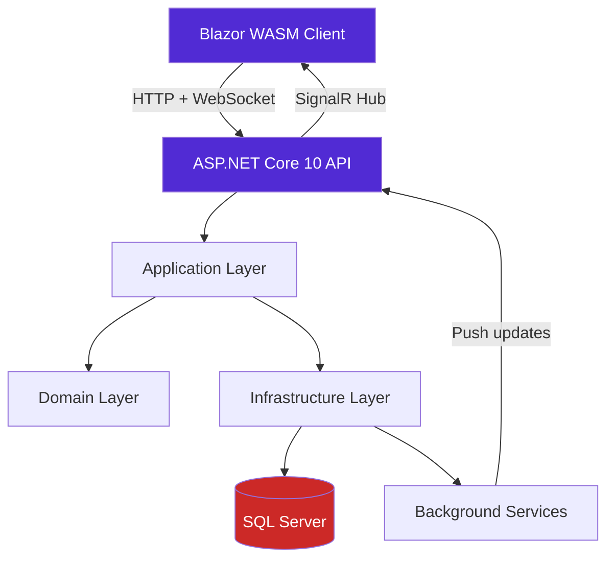

# realtime-ops-dashboard

> A full-stack real-time monitoring dashboard with live updates, role-based views,
> and alert management — built with ASP.NET Core 10, Blazor WebAssembly, and SignalR.


---

## Overview

Real-time operational dashboards are a cross-sector need — from logistics control
towers to trading floors to hospital capacity management. This project implements
a production-grade dashboard architecture using .NET's real-time capabilities.

The demo domain tracks **operational resource availability** with live updates,
threshold-based alerts, and multi-role access — constraints that stress-test the
architecture beyond typical tutorial scope.

---

## Architecture


**Key architectural decision — why SignalR over polling?**
Polling a monitoring endpoint every second creates O(n) server load with client count.
SignalR's hub model maintains persistent connections and pushes only delta updates,
keeping server load flat regardless of connected clients.

---

## Tech Stack

| Layer | Technology | Reason |
|---|---|---|
| Frontend | Blazor WebAssembly | Full .NET stack, no context switching to JS |
| Real-time | SignalR | Native ASP.NET integration, WebSocket with fallback |
| Backend | ASP.NET Core 10 | Minimal APIs + Controllers hybrid approach |
| ORM | Entity Framework Core 10 | Code-first migrations, LINQ query safety |
| Database | SQL Server | Matches target enterprise environment |
| Tests | xUnit + bUnit | bUnit for Blazor component testing |
| Container | Docker + Compose | Reproducible local dev environment |
| CI/CD | GitHub Actions | Build, test, and lint on every push |

---

## Getting Started

### Prerequisites

- [.NET 8 SDK](https://dotnet.microsoft.com/download/dotnet/8.0)
- [Docker Desktop](https://www.docker.com/products/docker-desktop/)
- Git

### Run with Docker (recommended)
```bash
git clone https://github.com/Byakkode/realtime-ops-dashboard
cd realtime-ops-dashboard
docker-compose up
```

App available at `http://localhost:5000`

### Run locally without Docker
```bash
# Restore dependencies
dotnet restore

# Apply database migrations
dotnet ef database update --project src/RealtimeDashboard.Infrastructure

# Run the API
dotnet run --project src/RealtimeDashboard.API
```

---

## Project Structure
```
src/
├── RealtimeDashboard.API/          # ASP.NET Core entry point, SignalR hubs
├── RealtimeDashboard.Application/  # Use cases, CQRS handlers, DTOs
├── RealtimeDashboard.Domain/       # Entities, domain events, interfaces
└── RealtimeDashboard.Infrastructure/ # EF Core, background services, repos
tests/
├── RealtimeDashboard.UnitTests/    # Domain + Application layer tests
└── RealtimeDashboard.IntegrationTests/ # API endpoint tests
docs/
└── diagrams/                       # Architecture diagrams
```

---

## Roadmap

- [x] Phase 1 — Repository setup, architecture, CI/CD pipeline
- [ ] Phase 2 — Domain model, EF Core migrations, seed data
- [ ] Phase 3 — SignalR hub + real-time update push
- [ ] Phase 4 — Blazor dashboard UI with live charts
- [ ] Phase 5 — Role-based views (admin / operator / viewer)
- [ ] Phase 6 — Alert thresholds and notification system
- [ ] Phase 7 — Docker Compose + deployment documentation

See [open issues](https://github.com/Byakkode/realtime-ops-dashboard/issues)
for detailed task breakdown.

---

## Key Decisions

- **Blazor WASM over React/Angular** — staying in the .NET ecosystem reduces
  context switching and demonstrates depth over breadth.
- **SignalR over SSE or raw WebSocket** — automatic fallback to long-polling
  in restricted network environments (common in enterprise/healthcare settings).
- **Clean Architecture** — enforces strict dependency rules testable at
  compile time, not just convention.

---

## License

MIT — see [LICENSE](LICENSE)
